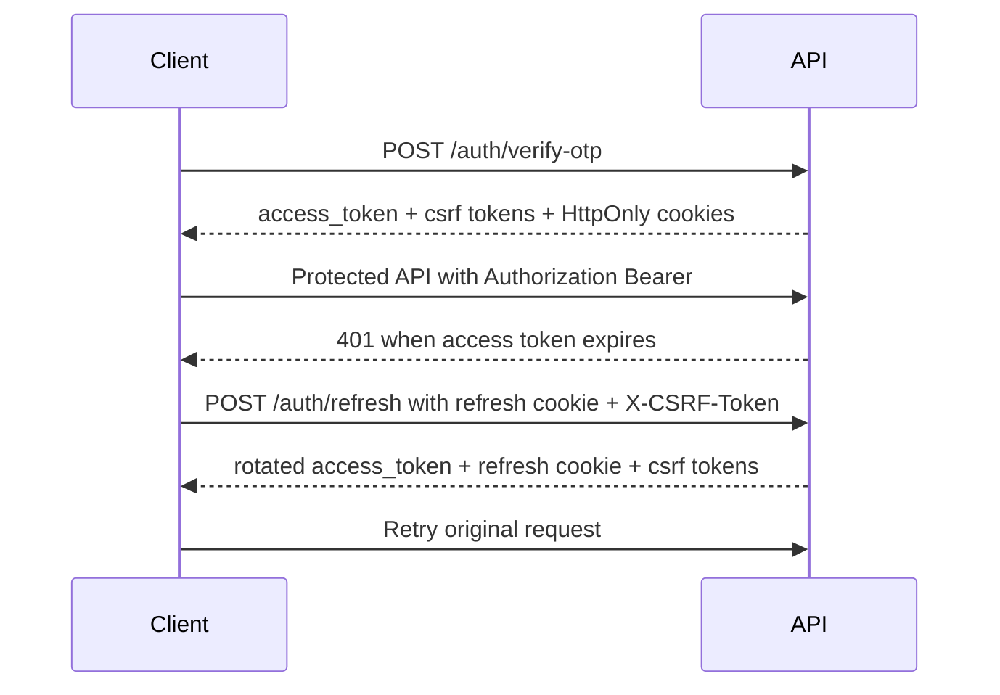
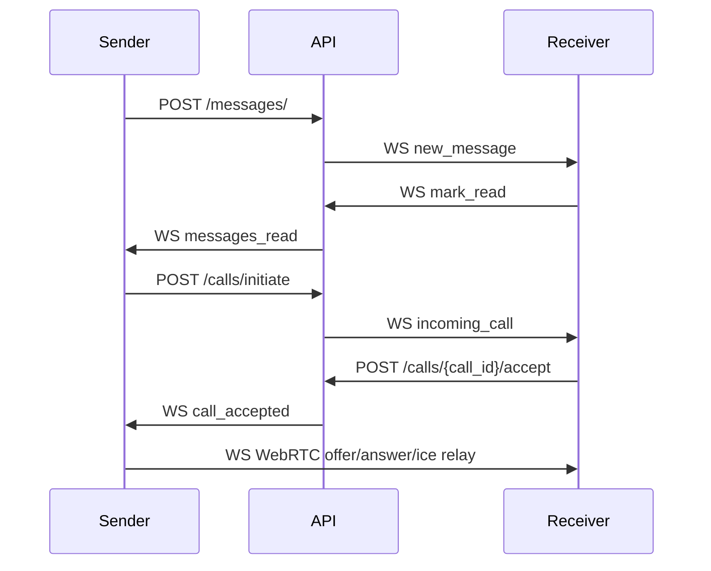

# API Flow Diagram

Generated: `2026-05-18T05:15:25.536878+00:00`

## Main Backend Flow

```mermaid
flowchart TD
  A[Open app] --> B[POST /api/v1/auth/send-otp]
  B --> C[Read OTP from backend console or OTP provider]
  C --> D[POST /api/v1/auth/verify-otp]
  D --> E{is_new_user?}
  E -->|true| F[PUT /api/v1/users/me]
  E -->|false| G[GET /api/v1/users/me]
  F --> H[Sync or search contacts]
  G --> H
  H --> I[POST /api/v1/contacts/sync-single or /contacts/sync]
  H --> J[GET /api/v1/users/search]
  I --> K[POST /api/v1/chats/ or /api/v1/groups/create]
  J --> K
  K --> L[GET /api/v1/chats/]
  L --> M[GET /api/v1/messages/{chat_id}]
  M --> N[POST /api/v1/media/upload optional]
  N --> O[POST /api/v1/messages/]
  M --> O
  O --> P[WS /api/v1/ws realtime events]
  P --> Q[typing, mark_read, WebRTC signaling]
```

## Authentication Refresh Flow



## Realtime Flow



<!-- API_TESTING_PROGRESS_START -->
## Latest Progress - API Testing And Usage System

Updated on: May 18, 2026

A complete FastAPI API testing and usage system has been generated for this project.

What is now available:
- Visual API dashboard: `docs/index.html`
- Main beginner API guide: `API_GUIDE.md`
- API usage examples: `API_USAGE_EXAMPLES.md`
- API flow diagrams: `API_FLOW_DIAGRAM.md`
- Postman collection: `POSTMAN_COLLECTION.json`
- Thunder Client collection: `THUNDER_CLIENT_COLLECTION.json`
- Bruno collection folder: `BRUNO_COLLECTION/`
- Automated API smoke-test runner: `scripts/test_all_apis.py`
- Regeneration utility: `scripts/generate_api_artifacts.py`

Current API inventory:
- 46 HTTP API operations detected
- 1 WebSocket route detected: `/api/v1/ws`
- 11 API modules grouped in the dashboard
- JWT Bearer authentication and cookie/CSRF refresh flow documented
- Upload, media, chat, message, call, status, reaction, user, contact, group, and auth APIs documented

Start here:
1. Start backend: `./start_backend.sh`
2. Serve API dashboard: `python3 -m http.server 4173 --directory docs`
3. Open dashboard: `http://localhost:4173/index.html`
4. Send OTP using `/api/v1/auth/send-otp`
5. Read OTP from backend terminal
6. Verify OTP using `/api/v1/auth/verify-otp`
7. Copy `access_token` into the dashboard or collection variables
8. Test protected APIs with `Authorization: Bearer <access_token>`

Useful test command:
```bash
.venv/bin/python scripts/test_all_apis.py --base-url http://localhost:8000
```

Notes:
- The generated dashboard is a static React/Tailwind page served from `docs/index.html`.
- Protected HTTP APIs use `Authorization: Bearer <access_token>`.
- Refresh uses the refresh cookie plus `X-CSRF-Token`.
- WebSocket auth currently reads the `access_token` cookie.
- Use `API_GUIDE.md` and `API_USAGE_EXAMPLES.md` when you need exact request and response examples.
<!-- API_TESTING_PROGRESS_END -->

