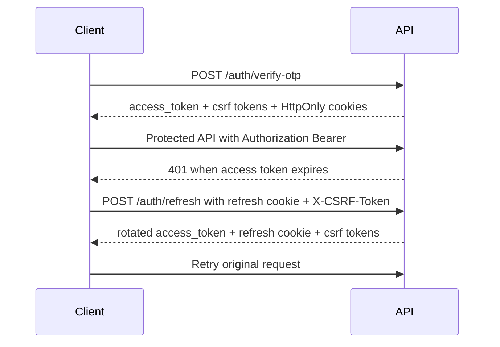
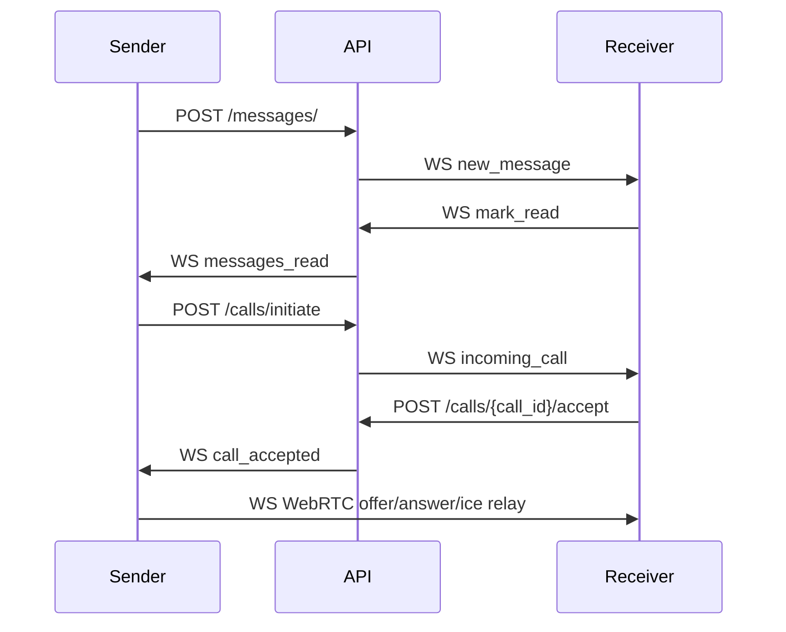

# API Flow Diagram

Generated: `2026-05-18T05:15:25.536878+00:00`

## Main Backend Flow

```mermaid
flowchart TD
  A[Open app] --> B[POST /api/v1/auth/send-otp]
  B --> C[Read OTP from backend console or OTP provider]
  C --> D[POST /api/v1/auth/verify-otp]
  D --> E{is_new_user?}
  E -->|true| F[PUT /api/v1/users/me]
  E -->|false| G[GET /api/v1/users/me]
  F --> H[Sync or search contacts]
  G --> H
  H --> I[POST /api/v1/contacts/sync-single or /contacts/sync]
  H --> J[GET /api/v1/users/search]
  I --> K[POST /api/v1/chats/ or /api/v1/groups/create]
  J --> K
  K --> L[GET /api/v1/chats/]
  L --> M[GET /api/v1/messages/{chat_id}]
  M --> N[POST /api/v1/media/upload optional]
  N --> O[POST /api/v1/messages/]
  M --> O
  O --> P[WS /api/v1/ws realtime events]
  P --> Q[typing, mark_read, WebRTC signaling]
```

## Authentication Refresh Flow



## Realtime Flow


